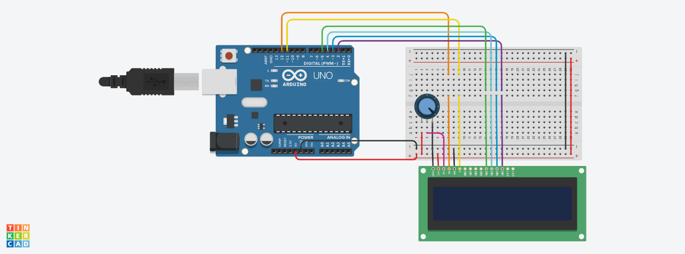

# Quartz Tuning Fork Sensor 

This program for Arduino reads the oscillation frequency of a quartz tuning fork, calculates a moving average of the last 15 readings and displays the average frequency to a LCD Display. Developed for sensor applications of a quartz resonator. 
 
### Working principle 
A quartz resonator is a tuning fork with two electrodes, which has definite resonance frequencies. Due to its high stability, precision, and low power consumption, the quartz crystal tuning fork has become a widely used component for frequency measurements. This device can also be used as a sensor: the oscillators resonant frequency is affected by the environment. Thus, the measured frequency can be used to quantify force, viscosity and mass density of fluids and other physical properties. 

### Component list 
- 220 kOhm resistor;
- 10 MOhm resistor;
- CI CMOS 4069;
- Arduino Uno;
- 32 kHz quartz oscillator, removed from its packaging;
- 30pF capacitors (2 units);
- LCD display (optional);

### How to wire the frequency meter circuit: 

  

### How to wire the LCD display:

  

### How to evaluate the frequency shift: 

 ### Based on the following articles: 
 1. [Introduction to the quartz tuning fork](https://www.researchgate.net/publication/228893284_Introduction_to_the_quartz_tuning_fork)
 2. [Accurate Determination of Viscosity and Mass Density of Fluids Using a Piezoelectric Tuning Fork Resonant Sensor](https://www.sciencedirect.com/science/article/abs/pii/S092442471400435X)
